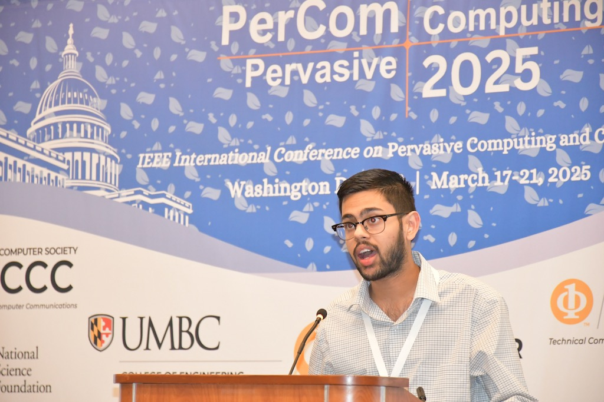

---

#### Me presenting at IEEE PerCom 2025

## Bio

I am a rising senior Electrical Engineering major in the <a href="https://eecs.uark.edu" target="_blank">Department of Electrical Engineering & Computer Science</a> at the University of Arkansas, advised by <a href="https://ahnelson.uark.edu" target="_blank">Dr. Alexander Nelson</a> in the <a href="https://aesir.uark.edu" target="_blank">ÆSIR Lab</a>. My research interests broadly span embedded systems, Internet of Things, and hardware security. Specifically, my current research mainly focuses on low-cost IoT for wearable sensing in clinically relevant contexts. I am also particularly interested in hardware security primitives such as physically unclonable functions (PUFs) to establish root-of-trust in IoT devices.

## Education

* **B.S. Electrical Engineering & Minor in Mathematics, May 2026**

     *University of Arkansas*

* **Study Abroad, Summer 2023**

     *Oriel College, University of Oxford*

## For Fun!

Outside of the lab and school, you can find me going to trivia nights, on the pickleball court, or watching a good movie! I also love Star Wars (it's true ask me anything), travelling, legos, and listening to music. 

