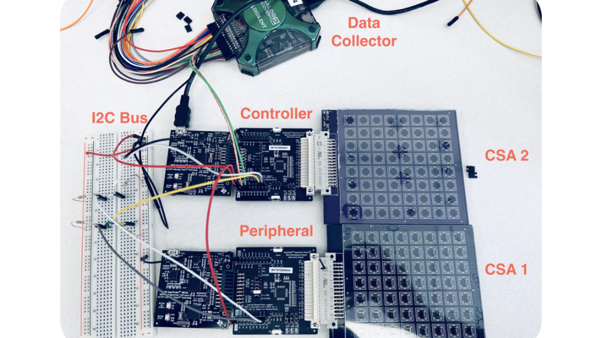

---

##### Download

+ [Paper](greentech_paper.pdf)
+ [Poster](greentech_poster.pdf)

---

##### Abstract

Capacitive sensing technology is widely applied in ubiquitous
sensing. Its low-power consumption enables it to be used in a wide variety
of Industry 4.0 applications. Capacitive Sensors can be combined into
Arrays (CSAs) with mutual capacitive sensing to reduce external wiring
requirements. For instance, the Texas Instruments (TI) MSP430FR2676
can capture and process data from 8x8 capacitive sensor grids. However,
it is limited to supporting only 64 sensors. We propose a design
incorporating daisy-chaining of CSAs via the I2C serial protocol to
enable support for 256 sensors. We also demonstrate a rapid prototyping
implementation of 128 sensors. The extended work we plan is to
implement the prototype on custom Printed Circuit Boards (PCB) and
maximize data update frequency. This architecture can find relevance in
industries like manufacturing and farming, enhancing precision in the
interaction between robots and humans/objects.

---

##### Figure 3: Proof of concept of daisy-chained architecture comprised of two 8x8 CSAs, one controller and periphera



---

##### Citation

A. Komanduri and A. Nelson, "Daisy-Chaining Embedded Processors for Enhanced Capacitive Sensor Array Resolution," 2024 IEEE Green Technologies Conference (GreenTech), Springdale, AR, USA, 2024, pp. 166-167, doi: 10.1109/GreenTech58819.2024.10520578.


```BibTeX
@INPROCEEDINGS{10520578,
  author={Komanduri, Abhinav and Nelson, Alexander},
  booktitle={2024 IEEE Green Technologies Conference (GreenTech)}, 
  title={Daisy-Chaining Embedded Processors for Enhanced Capacitive Sensor Array Resolution}, 
  year={2024},
  volume={},
  number={},
  pages={166-167},
  keywords={Wiring;Protocols;Service robots;Printed circuits;Robot sensing systems;Rapid prototyping;Capacitive sensors;Capacitive Sensor Arrays;Soft Robotics;Human-Robot Interaction;Embedded Systems},
  doi={10.1109/GreenTech58819.2024.10520578}}

```

---

