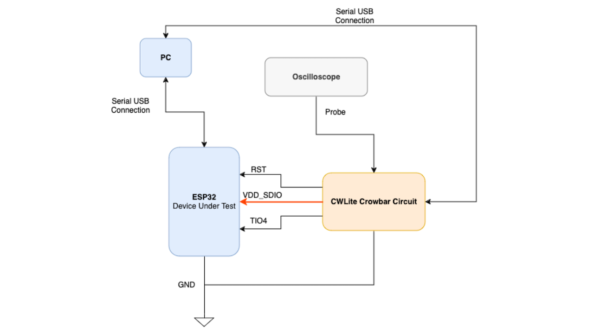

---

##### Download

+ [Paper](percom_paper.pdf)
+ [Poster](percom_poster.pdf)
+ [Teaser Poster](percom_minute.pdf)

---

##### Abstract

Physically Unclonable Functions (PUFs) are emerging lightweight hardware security primitives that utilize inherent manufacturing variations in integrated circuits to generate unique and reproducible digital fingerprints for authorization or authentication. This paper explores the implementation and evaluation of SRAM-based PUFs on the ESP32 microcontroller under normal and fault-injected operating conditions. A baseline PUF generation method is done, and its reliability and stability are evaluated using the intra-hamming distance. Fault injection attacks using voltage anomalies are employed to study the effects on the PUF’s reliability. Preliminary results show that while the PUF is stable under normal operating conditions, the reliability significantly decreases under faulted conditions. The results showcase the vulnerability of SRAM PUFs to environmental and operational factors and lay the groundwork for exploring additional fault injection methods and countermeasures for enhanced robustnesss

---

##### Figure 3: Proof of concept of daisy-chained architecture comprised of two 8x8 CSAs, one controller and periphera



---

##### Citation

```BibTeX
@INPROCEEDINGS {11038611,
    author = { Komanduri, Abhinav and Nelson, Alexander H. },
    booktitle = { 2025 IEEE International Conference on Pervasive Computing and Communications Workshops and other Affiliated Events (PerCom Workshops) },
    title = {{ Power PUFs: Strengthening SRAM PUFs Against Fault Injection on Low-Cost IoT Devices }},
    year = {2025},
    volume = {},
    ISSN = {},
    pages = {665-668},
    keywords = {Hardware security;Conferences;Random access memory;Voltage;Physical unclonable function;Robustness;Reproducibility of results;Circuit stability;Circuit faults;Internet of Things},
    doi = {10.1109/PerComWorkshops65533.2025.00158},
    url = {https://doi.ieeecomputersociety.org/10.1109/PerComWorkshops65533.2025.00158},
    publisher = {IEEE Computer Society},
    address = {Los Alamitos, CA, USA},
    month =mar}


---

