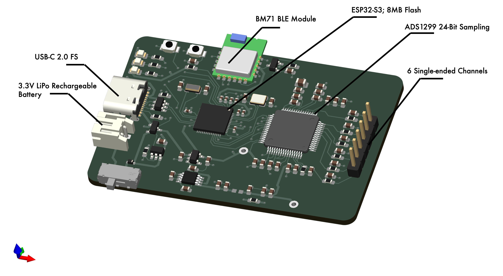
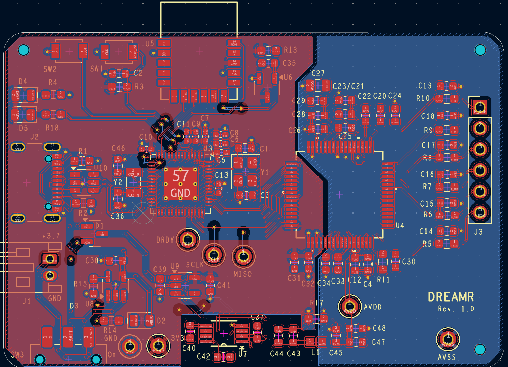
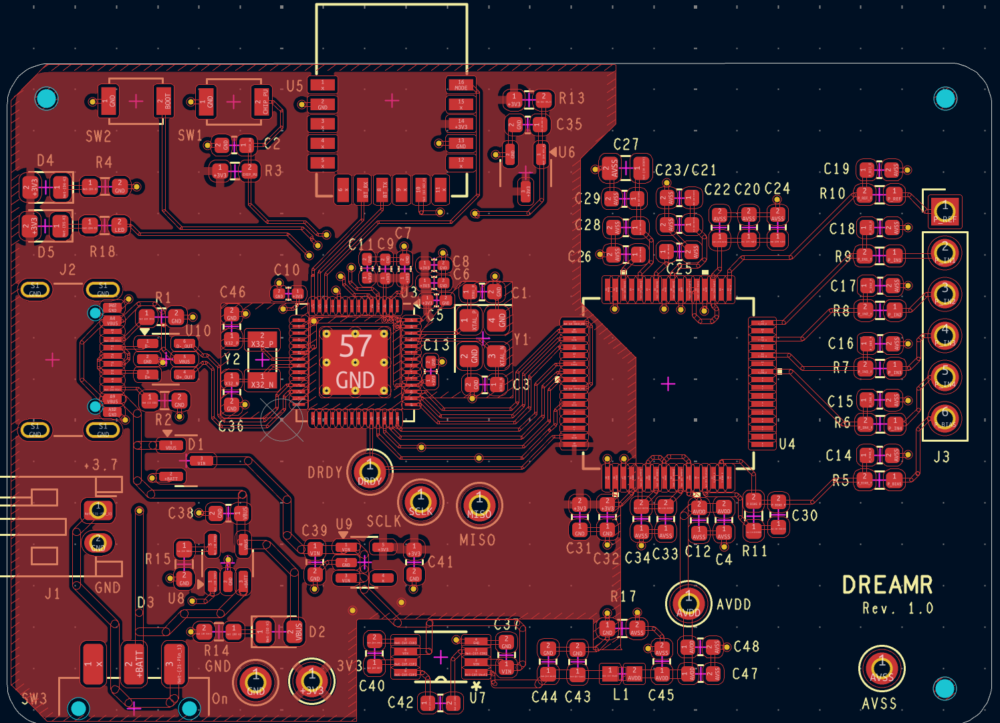
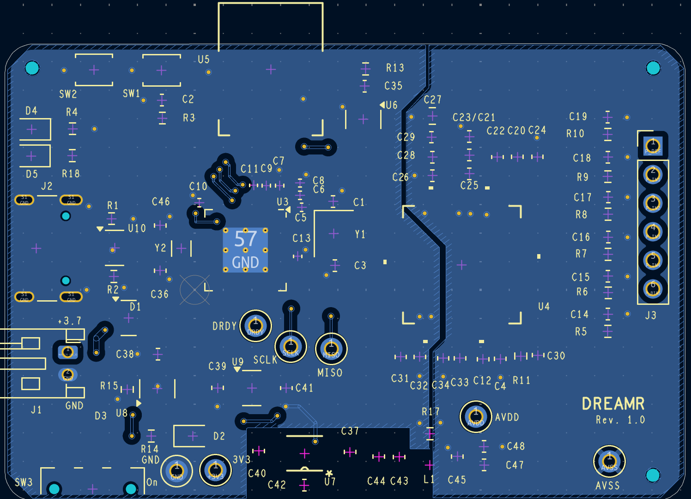

### Description
I designed a compact, battery-powered EEG acquisition system built around the TI ADS1299 biopotential analog front end for multi-channel neural signal capture. The system uses an ESP32-S3 microcontroller for real-time SPI data acquisition and control, with a separate pre-certified Bluetooth module handling wireless data transmission to a host device. The design emphasizes low-noise mixed-signal PCB techniques on a constrained 2-layer board, including careful power-domain isolation, quiet analog biasing, and safe battery charging from USB. This project required end-to-end schematic design, power-management trade-offs, and layout decisions balancing analog signal integrity, manufacturability, and academic design constraints.
### Schematics
+ [Schematic](WEEG1204.pdf)
### PCB Layout

---
