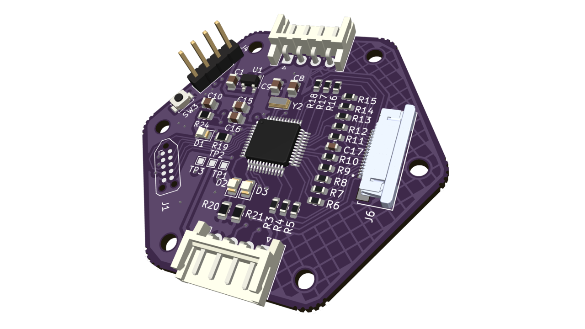

### Description
I am developing a wearable sensing system that combines high-resolution eTextile capacitive arrays with low-power, reconfigurable hardware to enable continuous limb-motion monitoring. By performing sensor fusion and physics-informed AI directly on the device, the system avoids cloud dependence while maintaining accuracy and all-day battery life. This work explores how embedded intelligence can be tightly integrated with human-centered hardware for scalable, real-world deployment.
### Schematics
Coming soon....
### PCB Layout
Coming soon....

---
